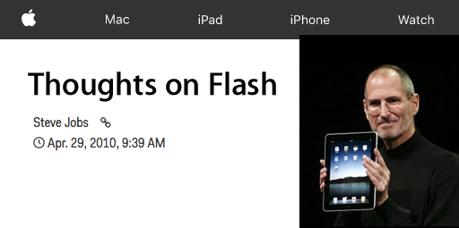

## Video <i class="little-header">on the</i> Web
_January 24th, 2018_ @ **Austin Web Python**
<!-- (Add background video) -->

---

## Who Am I?

* I'm Josh Marshall.
* I work at uStudio, a video software company.
* I've been working in video for a long time.

---

## Why Give This Talk?

* Video is a fantastically powerful medium. <!-- .element: class="fragment" -->
* ...the most efficient communication medium. <!-- .element: class="fragment" -->
* ...but comes at a high cost of complexity. <!-- .element: class="fragment" -->
* ...on the web, doubly so. <!-- .element: class="fragment" -->
* ...and you are all being asked to use it. <!-- .element: class="fragment" -->

---

## Caveat Emptor

1. We sell a platform that solves this stuff. <!-- .element: class="fragment" -->
2. There will be some video tech. <!-- .element: class="fragment" -->
3. There will be some web history. <!-- .element: class="fragment" -->
4. ...and not a lot of Python. <!-- .element: class="fragment" -->

---

# Alright.
## So You Want To Accept Video.

---

## A Familiar Story

* You've got a nice little web app.
* Maybe it's Django, maybe it's Flask.<!-- .element: class="fragment" -->
* Maybe it's some monstrosity<!-- .element: class="fragment" -->
  fueled by terror and anxiety,
  struggling under the weight of an infinite backlog.
* Your boss walks in.<!-- .element: class="fragment" -->

---

## How Hard Could It Be?

* "I was using Instagram the other day..."<!-- .element: class="fragment" -->
* "Why don't we let our users upload video too?"<!-- .element: class="fragment" -->
* "We already handle other files, right?"<!-- .element: class="fragment" -->
* "Nothing too crazy, just make it work like YouTube."<!-- .element: class="fragment" -->

---

# Just Sprinkle a Little ____ On It.

---

I'm going to walk through three areas.  
What is _(digital)_ video? 
How does it function on the web? 
How do I design software to use it?

---

 
A **video** is a series of frames.

---

 
A **frame** is a series of pixels.

---

 
A **pixel** is composed of RGB values. 
(A pixel is often square, but not always.)

---

---

_(and that doesn't include audio...)_

---

 
Audio is a series of samples.

---

---

 
We need to make this data smaller. 

---

 
...and we have been at it for decades.

---

## Video Structure
Container Formats 
Video Formats 
Audio Formats

---

 
Simplified diagram of a video file.

---

 
Example structure of ISO Base Media Format.

---

A **video codec** is responsible for organizing
_(and often compressing)_
the **frame** and **pixel** data of a video stream
into a standardized bitstream
in order to effectively read the content.

---

An **audio codec** is responsible for organizing
_(and often compressing)_
the **channel** and **sample** data of an audio stream
into a standardized bitstream
in order to effectively read the content.

---

A **container format** is responsible for organizing
_(and often multiplexing)_
the individual bitstreams of content
in order to effectively read the streams.

---

There are dozens of **container** formats. 
There are hundreds of **video** codecs. 
There are hundreds of **audio** codecs. 
That's a lot of combinations. 

---

Audio, video, and container formats are designed to solve specific problems. 
* Recording <!-- .element: class="fragment" -->
* Post production <!-- .element: class="fragment" -->
* Distribution <!-- .element: class="fragment" -->
* Streaming <!-- .element: class="fragment" -->
* Etc. <!-- .element: class="fragment" -->

---

Thankfully, there are some standardized general-purpose formats. 

---

You've likely heard of **MPEG**. 
You may not have heard of ISO/IEC JTC 1/SC 29/WG 11. 
You may have heard of **ITU-T**. 
You may not have heard of **VCEG**. 

---

MPEG and VCEG are two primary groups that have been involved in the creation,
ratification, and update of the most popular formats and standards. 
(Although that is rapidly changing.) 

---

* 1993: MPEG-1 (think MP3, VCD, etc.)
* 1995: MPEG-2 (cable boxes, DVDs, etc.)
* 1998: MPEG-4 (streaming, everything)

---

Each of these specifications has multiple parts, added over the years.
* MPEG-4 Part 1 (later Part 14) is the container format.
* MPEG-4 Part 10 is known as AVC / H.264 (2003).
* MPEG-4 Part 12 is the ISO BMF (2004).
* (MPEG-2 Part 7 is AAC, later MPEG4 Part 3.)

---

There are many other codecs and formats, including popular open source
standards like VP8/9 by Google and Ogg/Theora by Xiph, MKV, etc. 
(AV1 is coming.)

---

So how does video compression work?

Different codecs, different implementations. 
But we can start with the (very) basics.

---

 
Optimize values for human perception. (RGB -> YCrCb) 
Chroma subsampling.

---

 
Compress spatially. 
Known as "intraframe" compression.

---

 
Compress temporally. 
Known as "interframe" compression.

---

Entropy coding to further reduce storage. 
Wrap it all up in a bitstream standard.

---

 
Each codec brings its own complexity.

---

In short... 
Video is large. 
Video is complex. 
Video is evolving.

---

## Accepting Video

Right out of the gate, you're going to need to address much larger files.

Normal files typically don't balloon to gigs.

But videos do *all the time*.

---

## HTTP POST

You can accept video files via `multipart/form-data` in a traditional
`<form/>`...

But transferring gigs can be error prone.

Break up the file if possible into multiple POSTs.

---

## Storage

Cloud storage is your friend.

Direct upload is your friend.

But sometimes your friends are lazy.

Progress bar, chunked files, client success / error reporting, etc.

---

## Alternate Transfer

If you are running your own infrastructure... 
Range requests for partial upload / resume, 
Websockets for streaming chunks, 
WebRTC for capture and P2P sharing.

---

## Format Support

You will also need to know what you can accept. 
Files may come in any format, codecs, etc. 
Extensions / mimetypes not enough. 
Have a way to quickly inspect and reject.

---

## So Now You Have a File

You can just drop an HTML 
<pre class="clean-code"><code><video src="foo.mp4"></video></code></pre>
and it will work, right?

---

# A Brief History

---

 
In the late 90s and early 2000s, plugins ruled the world. 
Each plugin needed it's own transcode(s). 

---

 
Flash saved us from all that. 
In 2003, added progressive support. 
In 2005, added On2 VP6.

---

 

In 2007, Flash added H.264. 
Improved quality and reduced bitrate. 

---

Over the next few years, 
everything standardized on H.264.

An entire ecosystem of applications, 
players, content protection, ad networks, etc. 
grew out of Flash and H.264 across the web.

---

 
Then Steve Jobs destroyed it all.

---

Flash, like many plugins, was  heavy, buggy, and insecure. 

Luckily, since 2007, a new  standard had been in progress...

---

<!-- .slide: data-background-image="/images/light_bg.png" data-transition="zoom-in fade-out" -->
 

---

HTML5 media intended to make video first class elements, as opposed to a
plugin-encumbered format. 
<pre>
<code>
<video controls autoplay>
	<source src="myvideo.mp4" />
	<source src="myvideo.ogg" />
	<!-- fallback content -->
	Download <a href="myvideo.mp4">the video here</a>.
</video>

</code>
</pre>

---

However, there was much debate about a mandatory (MUST IMPLEMENT) format, and
warring camps emerged -- open source, and ISO standards.

Spoilers, no one won the debate.

---

Firefox and Opera originally backed Ogg/Theora.

Google bought On2 and released VP8.

In 2013, Cisco released OpenH264.

They also paid MPEG LA for any binary use.

Thus H.264/AAC/MP4 emerged as the "victor".

(As long as you install the OpenH264 plugin.)

---

So, back to the initial question: `<video/>`?

---

---

...but you still need to transcode that video!

---

## Transcoding

Transcoding is simply the process of decoding and encoding to another format.
In our workflow, we're going to be taking whatever input format was provided
and transcode to H.264 / AAC / MP4.

---

Know your settings for...

* Video and audio formats.<!-- .element: class="fragment" -->
* Video and audio bitrates.<!-- .element: class="fragment" -->
* Compression profiles.<!-- .element: class="fragment" -->
* Frame rate and sampling rate.<!-- .element: class="fragment" -->
* Audio channels.<!-- .element: class="fragment" -->
* Encapsulation format settings.<!-- .element: class="fragment" -->

---

There are many cloud based encoding providers, but they expect you to know
these things.

Alternatively, you can always roll your own with open source and / or paid
encoding tools.

---

## Example Command

<pre><code>
ffmpeg -i video.mov -vcodec libx264 -b:v 1200k \
    -profile:v main -preset:v medium -s 1280x720 -r 30 \
    -acodec aac -b:a 128k -ac 2 -ar 44.1k \
    -f mp4 video_720p.mp4

</code></pre>

---

## Progressive Streaming

Let's go back to how video files are laid out. 
For MP4, there is a section called `moov`. 
This is like an index required to play and seek. 
Unless specified, it's usually at the *end* of the file. 

---

That means you'd have to download the whole file.

---

Luckily, there's a parameter for this:

<pre class="clean-code"><code>
-movflags faststart
</code></pre>

---

Now, we have a file that is:
* Playable in a vast majority of browsers
* Conforms to standard device support
* Will stream progressively

---

<video controls autoplay muted>
    <source data-src="/videos/720p.mp4" />
</video>

---

Considerations...

* Transcoding can be SLOoowww.<!-- .element: class="fragment" -->
* So be aware of compute. (Task system!)<!-- .element: class="fragment" -->
* Transcoding results in other large files.<!-- .element: class="fragment" -->
* So be aware disk space.<!-- .element: class="fragment" -->
* Know your input settings.<!-- .element: class="fragment" -->
* (So you don't redo work.)<!-- .element: class="fragment" -->

---

Now that's just the old school stuff.

---

Progressive works everywhere, but has it's own issues.
* Tradeoff for quality and bandwidth<!-- .element: class="fragment" -->
* OR difficult to smoothly transition<!-- .element: class="fragment" -->
* MOOV atoms can get large for long files<!-- .element: class="fragment" -->
* Live streaming isn't possible over HTTP<!-- .element: class="fragment" -->

---

Along comes *adaptive*.

* 2009 - Apple writes HLS specification.
* 2011 - Adobe adds HDS to Flash Player.
* 2012 - MPEG-DASH is fully published.

---

All very similar...

* HLS - HTTP Live Streaming<!-- .element: class="fragment" -->
* HDS - HTTP Dynamic Streaming<!-- .element: class="fragment" -->
* DASH - Dynamic Adaptive Streaming over HTTP<!-- .element: class="fragment" -->

---

 

---

## Benefits of Adaptive

* Can seamlessly move between qualities
* Indexes are small because files are small (2-10s)
* Streams can be continuously generated
* Easier to scale storage, processing, etc.

---

Generating is still possible with FFMPEG.

<pre><code>
ffmpeg -i video.mov \
    -vcodec libx264 -b:v 3000k -profile:v main \
    -preset:v medium -s 1280x720 -r 24 \
    -acodec aac -b:a 128k -ac 2 -ar 44.1k \
    -f hls 720.m3u8 \
    -vcodec libx264 -b:v 1000k -profile:v main \
    -preset:v medium -s 640x360 -r 24 \
    -acodec aac -b:a 128k -ac 2 -ar 44.1k \
    -f hls 360.m3u8

</code></pre>

(Still need an index though.)

---

 
Only certain browsers support HLS natively.

---

 
Even fewer browsers support DASH natively.

---

Luckily, we have Media Source Extensions!

* Lower level Javascript API for feeding video and audio content directly to
  the player.<!-- .element: class="fragment" -->
* Able to implement most video streaming logic<!-- .element: class="fragment" -->
* Isn't available everywhere...<!-- .element: class="fragment" -->

---

 
IE 11 on Windows 7 ruins the fun.

---

A few popular open source options:

* HLS.JS - Supports HLS via MSE <!-- .element: class="fragment" -->
* DASH.JS - Supports DASH via MSE <!-- .element: class="fragment" -->
* Shaka - Supports DASH via MSE <!-- .element: class="fragment" -->

---

These typically wrap the `<video>` element and provide a friendly interface to
set manifest sources, track player events, etc.

---

<video id="hls-video" data-hls-src="/videos/720.m3u8" muted controls width="800" height="480"/>

---

But if you want to support IE 11 on Windows 7... 
...you still need Flash.

---

You now have video in your app... 
..and that's just getting started!

---

Things I haven't started addressing:

* Metadata management<!-- .element: class="fragment" -->
* Content extraction<!-- .element: class="fragment" -->
* Player customization and control<!-- .element: class="fragment" -->
* Statistics<!-- .element: class="fragment" -->
* Authorization / protection<!-- .element: class="fragment" -->
* Live streaming<!-- .element: class="fragment" -->
* Content review<!-- .element: class="fragment" -->
* ...and a lot more.<!-- .element: class="fragment" -->

---

(That's why we built a platform.)

---

## Changes on the Horizon

---

## New Formats

* HEVC / H.265 /MPEG-H Part 2 was ratified in 2013<!-- .element: class="fragment" -->
* VP9 has been in Chrome since 2013<!-- .element: class="fragment" -->
* AV1 is the new frontier<!-- .element: class="fragment" -->
* (Google, Netflix, Microsoft, and now Apple)<!-- .element: class="fragment" -->
* ...as always, watch the hardware support.<!-- .element: class="fragment" -->

---

## New Experiences

* 4K is on the rise<!-- .element: class="fragment" -->
* HDR is also on the rise<!-- .element: class="fragment" -->
* VR headsets, which means 360 degree video<!-- .element: class="fragment" -->
* WebVR specification!<!-- .element: class="fragment" -->
* WebRTC for peer-to-peer<!-- .element: class="fragment" -->

---

The only constant (with video) is change.

---

## Thanks!

* If you are interested in a video platform, come chat.
* My Twitter: @joshmarshall
* My Github: https://github.com/joshmarshall
* Slides will be up... soonish.

